I am trying to train a diffusion model and a flow model over CIFAR-10 with CFG to test if naive conditional generation fails.

See [visualization](visualization.ipynb) for detailed model architecture, training, sampling and evaluation details as well as how the graphs are plotted.

## Sample Generations

### Flow Model (CFG 1.0 vs 3.2)

<table>
<tr>
<th></th>
<th>airplane</th>
<th>automobile</th>
<th>bird</th>
<th>cat</th>
<th>deer</th>
</tr>
<tr>
<td><b>Naïve conditional samples</b></td>
<td>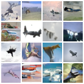</td>
<td>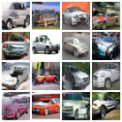</td>
<td>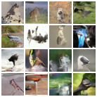</td>
<td>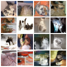</td>
<td>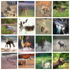</td>
</tr>
<tr>
<td><b>CFG Samples</b></td>
<td>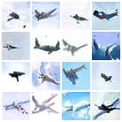</td>
<td>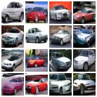</td>
<td>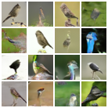</td>
<td>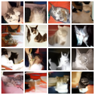</td>
<td>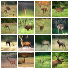</td>
</tr>
</table>

<table>
<tr>
<th></th>
<th>dog</th>
<th>frog</th>
<th>horse</th>
<th>ship</th>
<th>truck</th>
</tr>
<tr>
<td><b>Naïve conditional samples</b></td>
<td>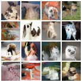</td>
<td>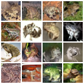</td>
<td>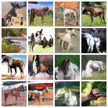</td>
<td></td>
<td>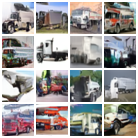</td>
</tr>
<tr>
<td><b>CFG Samples</b></td>
<td>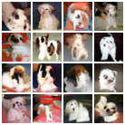</td>
<td>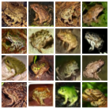</td>
<td>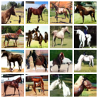</td>
<td>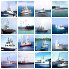</td>
<td>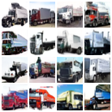</td>
</tr>
</table>

### Diffusion Model (CFG 1.0 vs 4.0)

<table>
<tr>
<th></th>
<th>airplane</th>
<th>automobile</th>
<th>bird</th>
<th>cat</th>
<th>deer</th>
</tr>
<tr>
<td><b>Naïve conditional samples</b></td>
<td>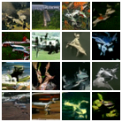</td>
<td>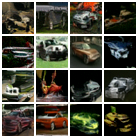</td>
<td>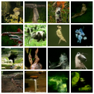</td>
<td>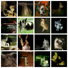</td>
<td>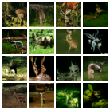</td>
</tr>
<tr>
<td><b>CFG Samples</b></td>
<td></td>
<td></td>
<td>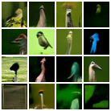</td>
<td>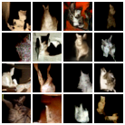</td>
<td>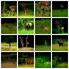</td>
</tr>
</table>

<table>
<tr>
<th></th>
<th>dog</th>
<th>frog</th>
<th>horse</th>
<th>ship</th>
<th>truck</th>
</tr>
<tr>
<td><b>Naïve conditional samples</b></td>
<td>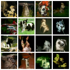</td>
<td></td>
<td>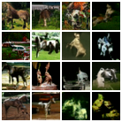</td>
<td></td>
<td>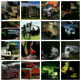</td>
</tr>
<tr>
<td><b>CFG Samples</b></td>
<td>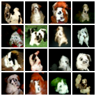</td>
<td>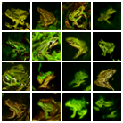</td>
<td>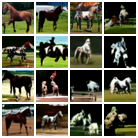</td>
<td>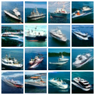</td>
<td>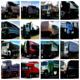</td>
</tr>
</table>

## Results: Diffusion vs Flow Comparison

### Global FID vs CFG Scale
| Diffusion | Flow |
|-----------|------|
|  |  |

### Global FID vs Sampling Steps
| Diffusion | Flow |
|-----------|------|
|  |  |

### Class-wise Quality-Diversity Tradeoff
| Diffusion | Flow |
|-----------|------|
|  |  |

### Class Separability
| Diffusion | Flow |
|-----------|------|
|  |  |
