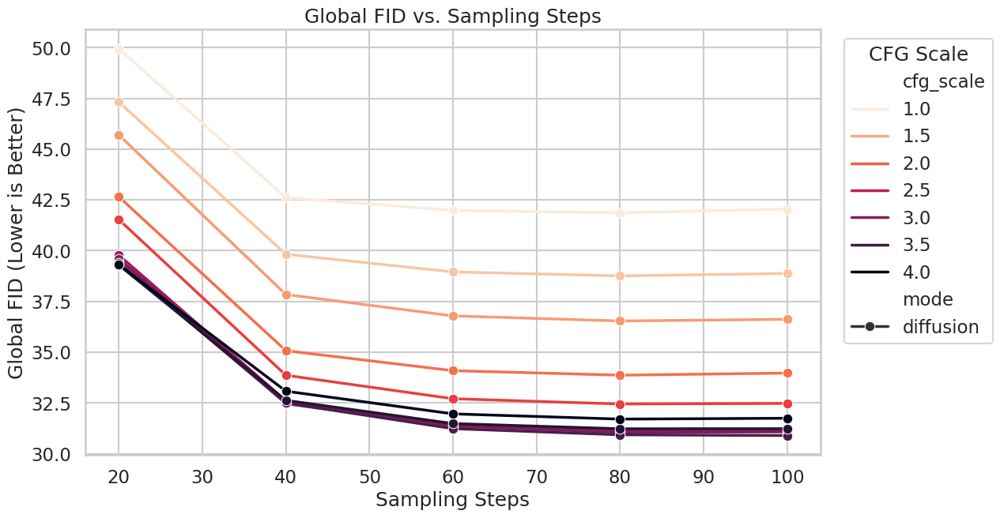
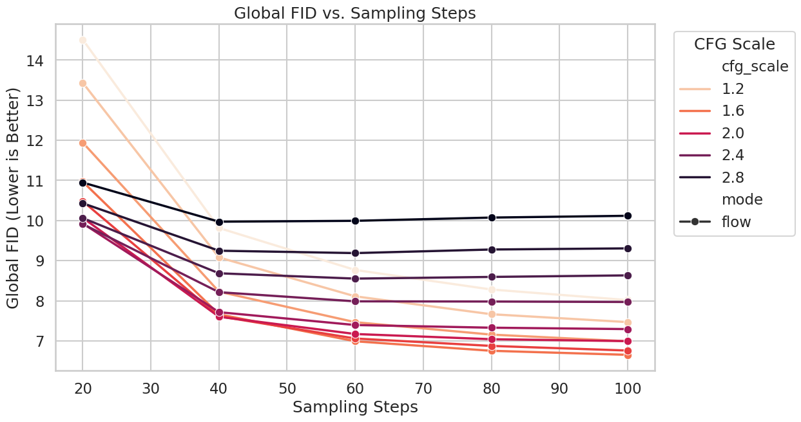
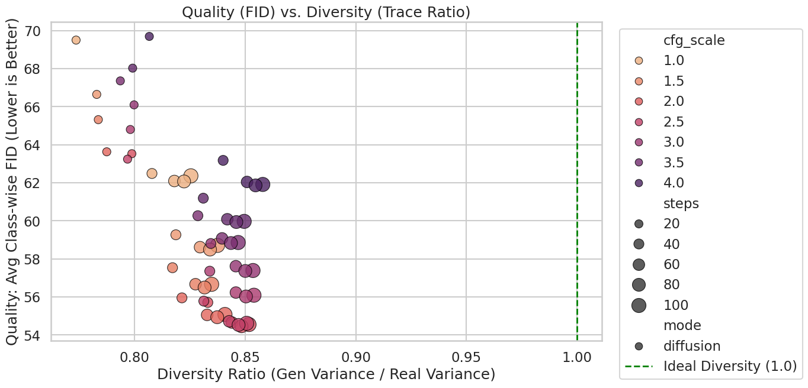
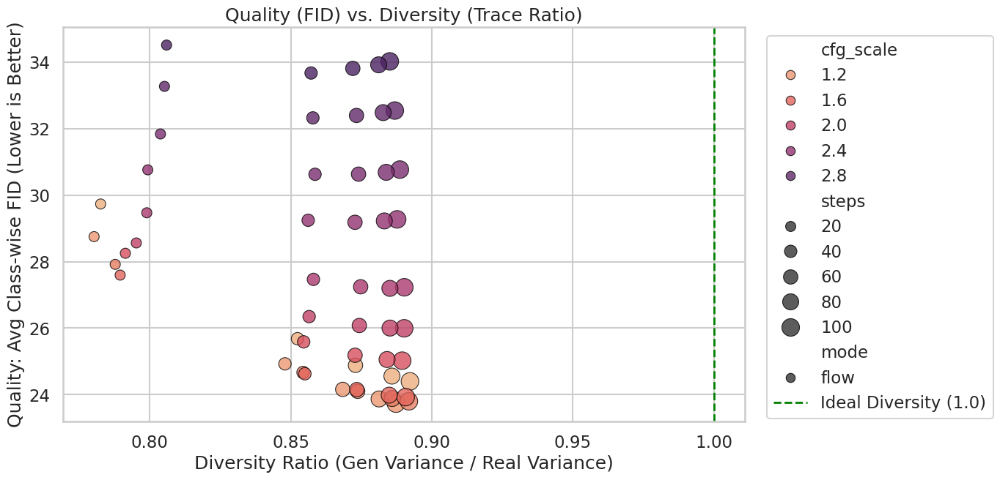
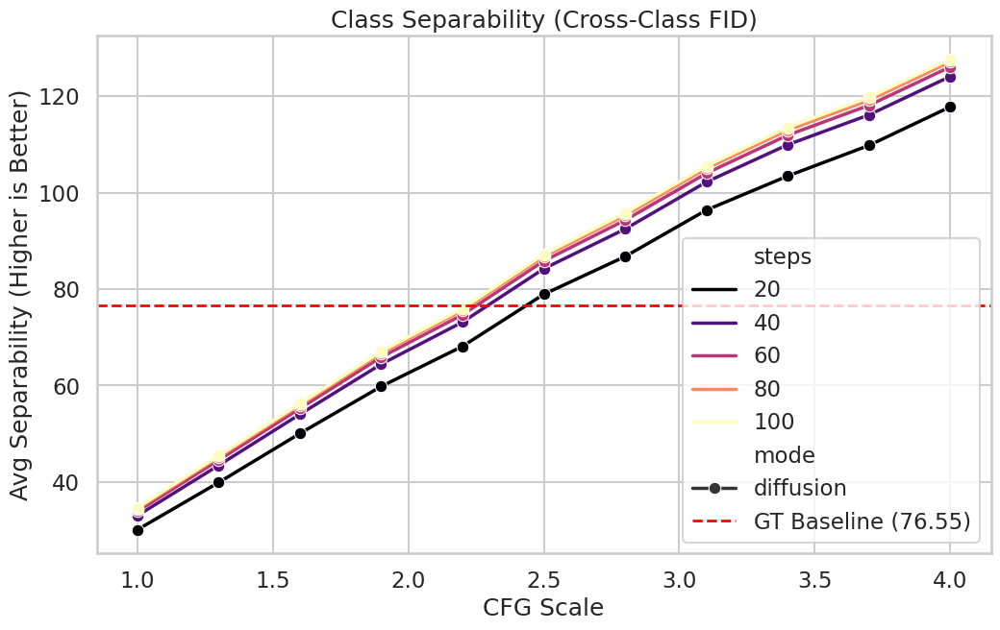
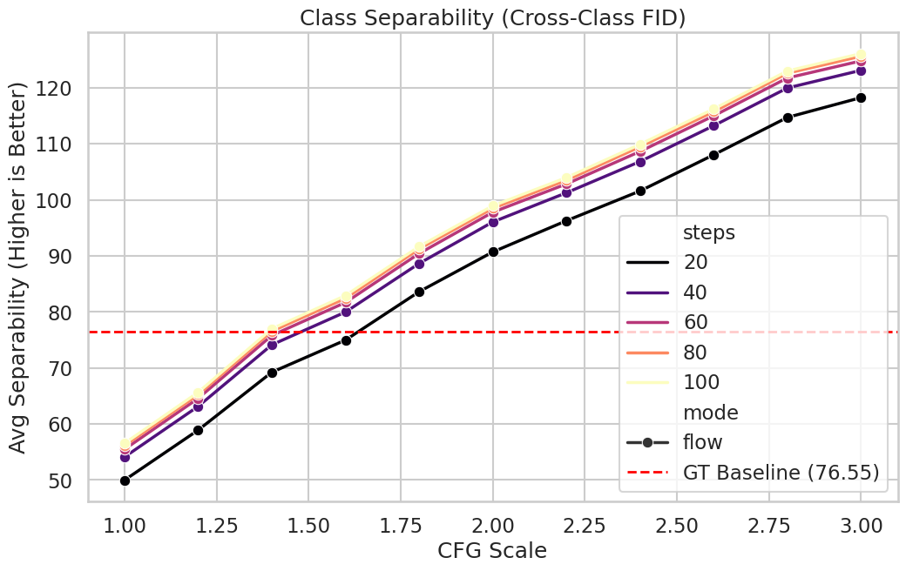

I am trying to train a diffusion model and a flow model over CIFAR-10 with CFG to test if naive conditional generation fails.

See [visualization](visualization.ipynb) for detailed model architecture, training, sampling and evaluation details as well as how the graphs are plotted. 

## Results: Diffusion vs Flow Comparison

### FID vs CFG Scale
| Diffusion | Flow |
|-----------|------|
|  |  |

### FID vs Sampling Steps
| Diffusion | Flow |
|-----------|------|
|  |  |

### Quality-Diversity Tradeoff
| Diffusion | Flow |
|-----------|------|
|  |  |

### Class Separability
| Diffusion | Flow |
|-----------|------|
|  |  |
